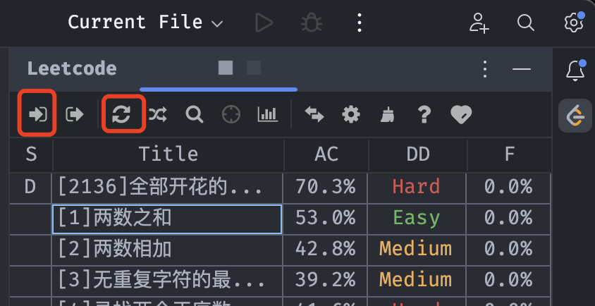

本文将介绍IntelliJ IDEA搭建LeetCode刷题环境。

## 1 安装LeetCode插件

Settings -> Plugins搜索LeetCode Editor插件并安装  

## 2 配置LeetCode插件

Settings -> Tools -> LeetCode Plugin, 配置URL(中国站和海外站)，CodeType(编程语言), LoginName(账号), Password(密码)

IDEA右侧边栏打开LeetCode插件，点击Sign in按钮和Refresh question按钮，刷新出题库，之后便可选择题目



## 3 配置模板

新建一个工程，如LeetCode，Settings -> Tools -> LeetCode Plugin配置TempFilePath目录为新建工程的src目录，然后勾选Custom Template使用自定义模板，配置模板自动生成测试代码

```java
${question.content}

package leetcode.editor.cn;

/*
 * ${question.title}
 * @author Lucian
 * @data $!velocityTool.date()
 */
public class $!velocityTool.camelCaseName(${question.titleSlug}) {
    public static void main(String[] args) {
        // Test case
        Solution solution = new $!velocityTool.camelCaseName(${question.titleSlug})().new Solution();
    }

// LeetCode代码
${question.code}
}
```

Code FileName(文件名)配置为类名$!velocityTool.camelCaseName(${question.titleSlug})

