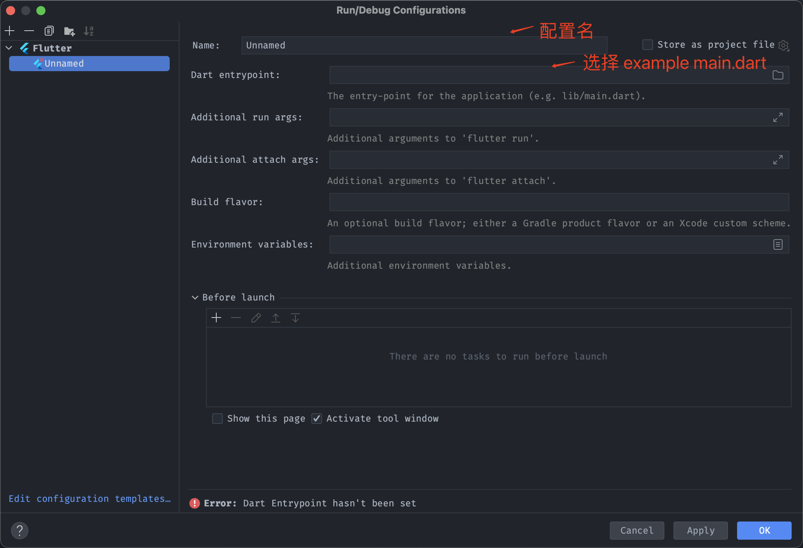

本文介绍如何创建和发布自己的Flutter Package。

## 1 创建Package

```
# [package_name]需要替换为自己的package name
flutter create --template=package [package_name]
```

## 2 创建example

进入Package根目录，执行命令

```
flutter create example
```

添加example main.dart运行配置，启动编译后自动运行example main.dart



## 3 发布Package

在发布前确认`pubspec.yaml`的description, vesion和homepage信息是否正确，以及CHANGELOG.md修改版本记录

### 3.1 代码检查

```
dart analyze lib
```

修改所有的error和warning错误

### 3.1预发布

```
flutter pub publish --dry-run
```

确认预发布信息正确

### 3.2 正式发布

```
flutter pub publish
```

